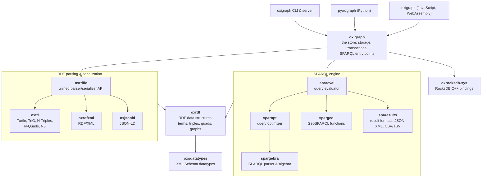
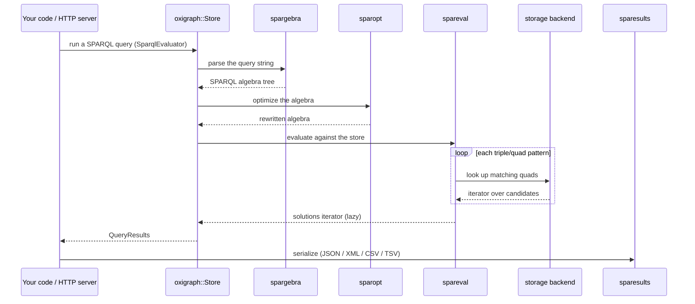

# Architecture overview

Oxigraph is a workspace of small, focused crates. Understanding which crate owns
what lets you predict where a change belongs before you start digging.

## The crate layers

Dependencies point downward: everything is built on `oxrdf`'s data structures,
and the `oxigraph` crate assembles the parsing and SPARQL stacks into a store
that the CLI and the language bindings wrap.

(The diagram shows the primary dependencies; a few crates also use `oxrdf`
helpers directly. The authoritative list is each crate's `Cargo.toml`.)

Two consequences of this layout worth internalizing:

- **The parsing stack and the SPARQL stack don't know about each other.** They
  only share `oxrdf`. A change to Turtle parsing can't break query evaluation,
  and vice versa.
- **Everything below `oxigraph` is storage-agnostic.** The parsers and the
  SPARQL algebra work on in-memory terms; only the `oxigraph` crate knows data
  lives in RocksDB.

## How a SPARQL query flows through the system

Evaluation is lazy: solutions are produced as the application iterates over the
results, pulling matching quads from storage on demand rather than materializing
everything up front.

## The storage layer

`oxigraph::store::Store` sits on one of two backends behind the same interface
(`lib/oxigraph/src/storage/`):

- **RocksDB** (via `oxrocksdb-sys`, compiled from the vendored RocksDB
  submodule) for on-disk, transactional persistence.
- **An in-memory backend** (`storage/memory.rs`) used when you create a store
  without a path — and the only option in WebAssembly builds like the JS
  package.

Two ideas drive the on-disk layout:

- **Terms are interned.** Every IRI, literal, and blank node is encoded to a
  fixed-size id (`storage/numeric_encoder.rs`); one `id2str` column family maps
  ids back to strings. Quads are then just tuples of ids.
- **Quads are stored several times, in different orders.** Column families such
  as `spog`, `posg`, and `ospg` (and `dspo`/`dpos`/`dosp` for the default
  graph) hold the same quads sorted differently, so that whatever triple
  pattern a query needs, there is an ordering that answers it with a prefix
  scan rather than a full scan.

Writes go through RocksDB transactions, and reads work on snapshots, so queries
see a consistent view of the data while updates run.

## Going deeper

- [The upstream wiki's architecture page](https://github.com/oxigraph/oxigraph/wiki/Architecture)
  — the design rationale in more depth.
- [docs.rs/oxigraph](https://docs.rs/oxigraph) — the public API these layers add
  up to; each standalone crate ([oxrdf](https://docs.rs/oxrdf),
  [oxrdfio](https://docs.rs/oxrdfio), [spargebra](https://docs.rs/spargebra),
  [spareval](https://docs.rs/spareval), …) has its own documentation too.
- [How the language bindings work](language-bindings.md) — how pyoxigraph and
  the JS package wrap the layers above, and where a new language would attach.
- The [crate map](../reference/crates.md) — one-line responsibilities and links
  for every workspace member.
