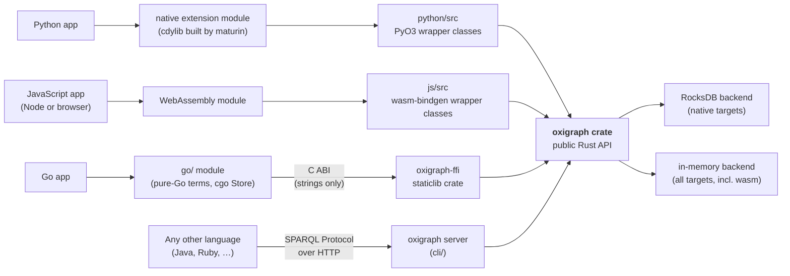

# How the language bindings work

Oxigraph supports Python, JavaScript, and Go without a client/server split:
all three bindings run the engine *inside* the host language's process. This
page explains the pattern, how each binding applies it, and — if you are
thinking about a binding for another language (Java, Ruby, …) — which layer
such a binding would attach to.

## The pattern

Every binding is a **hand-written wrapper around the public Rust API of the
[`oxigraph` crate](https://docs.rs/oxigraph)** (`Store`, the `model` types,
`SparqlEvaluator`), bridged to the host language by a language-specific
toolchain. Languages with a Rust-native bridge (PyO3, wasm-bindgen) talk to
the crate directly; Go, which has none, goes through a deliberately small
C ABI:

- **One narrow C ABI, only where needed.** Python and JavaScript use
  Rust-native bridges with no `extern "C"` layer. Go consumes
  [`oxigraph-ffi/`](../../../oxigraph-ffi), a `staticlib` crate whose whole
  surface is about ten string-based functions — nothing structured crosses
  it ([ADR 0001](../../decisions/0001-embed-oxigraph-in-go-via-c-abi-ffi.md)).
- **No IPC.** Calls from Python, JavaScript, or Go are in-process function
  calls into the engine — no socket, no serialization boundary beyond the
  strings the Go FFI exchanges.
- **In-tree.** The wrappers live in this repository (`python/`, `js/`,
  `go/` + `oxigraph-ffi/`) and version with the core, so an engine change
  and its binding updates land in one commit.

## Python: PyO3 + maturin

`python/src/` defines [PyO3](https://pyo3.rs/) classes that wrap the crate's
types one-to-one (`Store`, terms, quads, the parsers). The crate is compiled
into a native extension module — `python/Cargo.toml` sets
`crate-type = ["cdylib"]` — and [maturin](https://www.maturin.rs/) packages it
as a wheel per platform. The dependency opts into the crate's default features
(`default-features = true`), so the wheel embeds RocksDB and pyoxigraph gets
the full on-disk, transactional store.

## JavaScript: wasm-bindgen + WebAssembly

`js/src/` does the same job with
[wasm-bindgen](https://rustwasm.github.io/docs/wasm-bindgen/): wrapper classes
compiled to the `wasm32-unknown-unknown` target and shipped as an npm package.
The workspace declares the `oxigraph` dependency with
`default-features = false`, and `js/Cargo.toml` enables only the `js` feature —
so the wasm build contains **no RocksDB** (WebAssembly has no filesystem) and
the JS `Store` is in-memory only. That single feature flag is the whole
difference between the two bindings' capabilities.

## Go: cgo + the `oxigraph-ffi` C ABI

Go has no Rust-native bridge, so its binding is the tree's one `extern "C"`
surface, split across two layers
([ADR 0001](../../decisions/0001-embed-oxigraph-in-go-via-c-abi-ffi.md)):

- **`oxigraph-ffi/`** compiles the crate into a static library behind about
  ten coarse, string-based functions (`open`, `close`, `query`, `update`,
  `add`, `remove`, `load`, `dump`, …). Whole operations cross the boundary —
  a query returns fully serialized SPARQL JSON or N-Triples — and no term
  objects, iterators, or transactions do, which sidesteps the classic FFI
  lifetime hazards. Failures come back through per-call `char **` error
  out-parameters (thread-affine error state is unsafe under Go's scheduler).
- **`go/`** is the public module. The RDF term model (`NamedNode`,
  `Literal`, `Quad`, …) is pure Go with pyoxigraph-parity semantics —
  construction and validation never cross the FFI — and `Store` wraps the
  C ABI with cgo. Consumers link a prebuilt per-platform
  `liboxigraph_ffi.a` (vendored under `go/lib/`, built by the `go.yml`
  workflow), so Rust stays a CI-only dependency; the crate's default
  features are on, so the Go store gets the full on-disk RocksDB backend.

## Where would a Java (or Ruby, …) binding attach?

The same three layers Go chose between, in increasing order of effort:

1. **The HTTP layer — works today, no binding code.** The server implements
   the W3C [SPARQL Protocol](https://www.w3.org/TR/sparql11-protocol/) and
   [Graph Store Protocol](https://www.w3.org/TR/sparql11-http-rdf-update/), so
   any language with an HTTP client already has full access, including
   persistence. The cost is running a separate process and a network hop per
   request. This is the pragmatic answer whenever "embedded" isn't a hard
   requirement.

2. **The WebAssembly build — embed the engine without native code.** The same
   wasm artifact the JS package uses can run inside a wasm runtime embedded in
   the host language. You inherit the wasm build's limits: in-memory storage
   only, and wasm-level performance.

3. **The C ABI — the full-fidelity route Go took.** `oxigraph-ffi` already
   exists, so a new binding can link the same static library and wrap the
   same ten functions the Go module wraps. The remaining costs are the
   host-language wrapper (memory ownership at the boundary, error mapping)
   and per-platform native builds — the string-based surface keeps the
   re-verification burden per engine release small by design.

The short version: **the `oxigraph` crate's Rust API is the binding surface.**
Python and JavaScript reach it through Rust-native bridges; Go reaches it
through the in-tree `oxigraph-ffi` C ABI; a new language either talks to the
server over HTTP, embeds the wasm build, or links `oxigraph-ffi` like Go does.

## Sources and further reading

- [The upstream wiki's architecture page](https://github.com/oxigraph/oxigraph/wiki/Architecture)
  — the core engine design (storage encoding, Volcano-style evaluation).
- The binding manifests are the ground truth for how each wrapper is built:
  [`python/Cargo.toml`](../../../python/Cargo.toml),
  [`js/Cargo.toml`](../../../js/Cargo.toml),
  [`oxigraph-ffi/Cargo.toml`](../../../oxigraph-ffi/Cargo.toml), and the
  workspace [`Cargo.toml`](../../../Cargo.toml) feature defaults.
- [ADR 0001](../../decisions/0001-embed-oxigraph-in-go-via-c-abi-ffi.md) —
  why the Go binding is a C ABI + prebuilt static libraries rather than a
  server client or a wasm embed.
- [PyO3](https://pyo3.rs/), [maturin](https://www.maturin.rs/),
  [wasm-bindgen](https://rustwasm.github.io/docs/wasm-bindgen/), and
  [cgo](https://pkg.go.dev/cmd/cgo) — the bridge toolchains the bindings use.
