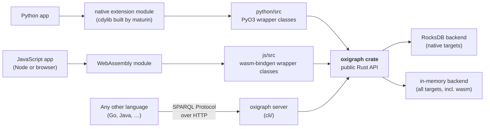

# How the language bindings work

Oxigraph supports Python and JavaScript without a client/server split: both
bindings run the engine *inside* the host language's process. This page
explains the pattern, how each binding applies it, and — if you are thinking
about a binding for another language (Go, Java, Ruby, …) — which layer such a
binding would attach to.

## The pattern

Every binding is a **hand-written Rust wrapper around the public Rust API of
the [`oxigraph` crate](https://docs.rs/oxigraph)** (`Store`, the `model` types,
`SparqlEvaluator`), compiled as a `cdylib` and bridged to the host language by
a language-specific toolchain. There is deliberately no intermediate layer:

- **No C ABI.** The tree contains no `extern "C"` interface. Rust-native
  bridges (PyO3, wasm-bindgen) talk to the crate directly, which keeps the
  wrappers thin and type-safe.
- **No IPC.** Calls from Python or JavaScript are in-process function calls
  into the engine — no socket, no serialization boundary.
- **In-tree.** The wrappers live in this repository (`python/`, `js/`) and
  version with the core, so an engine change and its binding updates land in
  one commit.

## Python: PyO3 + maturin

`python/src/` defines [PyO3](https://pyo3.rs/) classes that wrap the crate's
types one-to-one (`Store`, terms, quads, the parsers). The crate is compiled
into a native extension module — `python/Cargo.toml` sets
`crate-type = ["cdylib"]` — and [maturin](https://www.maturin.rs/) packages it
as a wheel per platform. The dependency opts into the crate's default features
(`default-features = true`), so the wheel embeds RocksDB and pyoxigraph gets
the full on-disk, transactional store.

## JavaScript: wasm-bindgen + WebAssembly

`js/src/` does the same job with
[wasm-bindgen](https://rustwasm.github.io/docs/wasm-bindgen/): wrapper classes
compiled to the `wasm32-unknown-unknown` target and shipped as an npm package.
The workspace declares the `oxigraph` dependency with
`default-features = false`, and `js/Cargo.toml` enables only the `js` feature —
so the wasm build contains **no RocksDB** (WebAssembly has no filesystem) and
the JS `Store` is in-memory only. That single feature flag is the whole
difference between the two bindings' capabilities.

## Where would a Go (or Java, or Ruby) binding attach?

There are three realistic attachment layers, in increasing order of effort:

1. **The HTTP layer — works today, no binding code.** The server implements
   the W3C [SPARQL Protocol](https://www.w3.org/TR/sparql11-protocol/) and
   [Graph Store Protocol](https://www.w3.org/TR/sparql11-http-rdf-update/), so
   any language with an HTTP client already has full access, including
   persistence. The cost is running a separate process and a network hop per
   request. This is the pragmatic answer whenever "embedded" isn't a hard
   requirement.

2. **The WebAssembly build — embed the engine without native code.** The same
   wasm artifact the JS package uses can run inside a wasm runtime embedded in
   the host language (for Go, e.g. wazero, avoiding cgo entirely). You inherit
   the wasm build's limits: in-memory storage only, and wasm-level
   performance.

3. **A new C ABI over the `oxigraph` crate — the full-fidelity route.** For an
   embedded binding with on-disk storage, the missing piece is a foreign
   function interface: a new `cdylib` crate exposing `extern "C"` functions
   over `Store` and friends (hand-written, or generated with FFI tooling),
   which Go would consume through cgo — the same way Go links RocksDB or
   SQLite today. This is how most languages without a Rust-native bridge embed
   Rust libraries. The real costs are API design (memory ownership, error
   mapping, iterator lifetimes across the boundary), per-platform native
   builds, and keeping the C surface in sync with the crate as it evolves —
   exactly the maintenance the in-tree bindings avoid by being written in
   Rust.

The short version: **the `oxigraph` crate's Rust API is the binding surface.**
Python and JavaScript each reach it through a Rust-native bridge; a language
without such a bridge either talks to the server over HTTP, embeds the wasm
build, or needs a C ABI written for it.

## Sources and further reading

- [The upstream wiki's architecture page](https://github.com/oxigraph/oxigraph/wiki/Architecture)
  — the core engine design (storage encoding, Volcano-style evaluation).
- The binding manifests are the ground truth for how each wrapper is built:
  [`python/Cargo.toml`](../../../python/Cargo.toml),
  [`js/Cargo.toml`](../../../js/Cargo.toml), and the workspace
  [`Cargo.toml`](../../../Cargo.toml) feature defaults.
- [PyO3](https://pyo3.rs/), [maturin](https://www.maturin.rs/), and
  [wasm-bindgen](https://rustwasm.github.io/docs/wasm-bindgen/) — the bridge
  toolchains the existing bindings use.
