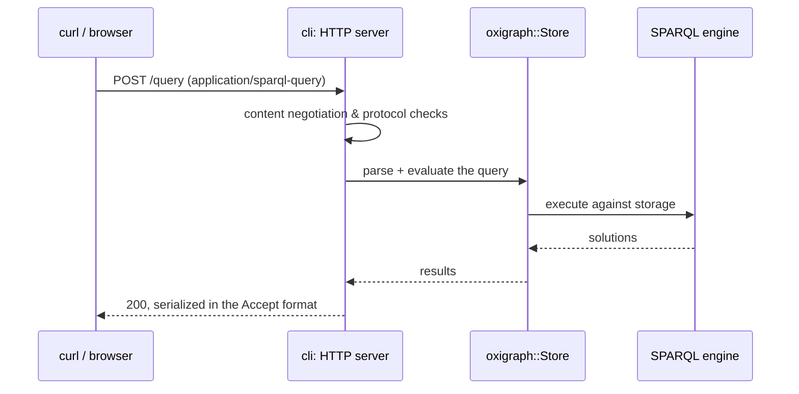

# Work on the CLI and server

**Goal:** build the `oxigraph` binary from your checkout, run the SPARQL server
locally, and hit it with a query.

The CLI lives in `cli/` (the crate is `oxigraph-cli`; `server/` is a symlink
kept from when it was named Oxigraph server). It provides both the command-line
data tools (`load`, `dump`, `query`, `optimize`, …) and the HTTP server
implementing the SPARQL 1.1 Protocol and the Graph Store Protocol.

## Build and run

```sh
cargo run -p oxigraph-cli -- --help
cargo run -p oxigraph-cli -- serve --location ./data
```

The server listens on <http://localhost:7878> (a query editor UI in the
browser, protocol endpoints underneath). From another terminal:

```sh
curl -X POST http://localhost:7878/query \
  -H 'Content-Type: application/sparql-query' \
  --data 'SELECT * WHERE { ?s ?p ?o } LIMIT 10'
```

## What a request does



## Test

The CLI has integration tests (using `assert_cmd`) alongside its sources:

```sh
cargo test -p oxigraph-cli
```

For manual protocol testing, the [HTTP how-to in the user docs](../../users/how-to/http.md)
lists ready-made `curl` invocations for every endpoint — they work identically
against a dev build.
