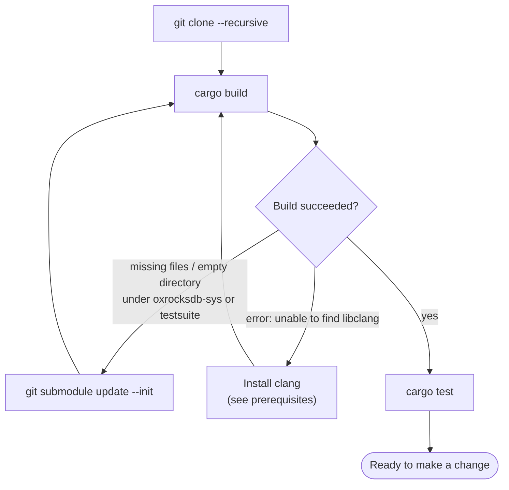

# Build, run, and test Oxigraph from source

In this tutorial you will go from a fresh clone to a locally built Oxigraph, run
your build from a small Rust program, and run the test suite. Expect the first
build to take a while: Oxigraph compiles its RocksDB storage engine from source.

## 1. Install the prerequisites

- A Rust toolchain, installed with [rustup](https://rustup.rs/). Oxigraph tracks
  recent stable Rust.
- A C/C++ compiler with libclang — RocksDB is C++ and its Rust bindings are
  generated with [bindgen](https://rust-lang.github.io/rust-bindgen/), which
  needs libclang at build time:
  - **macOS:** `xcode-select --install`
  - **Debian/Ubuntu:** `sudo apt install clang`
  - **Fedora:** `sudo dnf install clang`
- `git`.

## 2. Clone with submodules

Oxigraph vendors RocksDB, lz4, the W3C test suites, and the server's query editor
as git submodules, so a plain clone is not enough:

```sh
git clone --recursive https://github.com/oxigraph/oxigraph.git
cd oxigraph
```

If you already cloned without `--recursive`, fetch the submodules into the
existing clone:

```sh
git submodule update --init
```

## 3. Build the workspace

```sh
cargo build
```

This builds every crate in the workspace — the `oxigraph` library, all the
parsing and SPARQL crates under `lib/`, and the CLI. The first run compiles
RocksDB and can take several minutes; afterwards incremental builds are fast.

## 4. Run your build

Prove the library you just built actually works by calling it from a scratch
program. From the directory *above* your clone:

```sh
cargo new hello-oxigraph
cd hello-oxigraph
cargo add oxigraph --path ../oxigraph/lib/oxigraph
```

Replace `src/main.rs` with:

```rust
use oxigraph::model::*;
use oxigraph::sparql::{QueryResults, SparqlEvaluator};
use oxigraph::store::Store;

fn main() -> Result<(), Box<dyn std::error::Error>> {
    let store = Store::new()?;

    store.insert(Quad::new(
        NamedNode::new("http://example.com/oxigraph")?,
        NamedNode::new("http://www.w3.org/2000/01/rdf-schema#label")?,
        Literal::new_simple_literal("Oxigraph"),
        GraphName::DefaultGraph,
    ))?;

    if let QueryResults::Solutions(solutions) = SparqlEvaluator::new()
        .parse_query("SELECT ?name WHERE { ?s ?p ?name }")?
        .on_store(&store)
        .execute()?
    {
        for solution in solutions {
            println!("{}", solution?.get("name").unwrap());
        }
    }
    Ok(())
}
```

(This is the API of the development branch you just built. The released crate on
crates.io can differ — the [user guides](../../users/README.md) target the
releases.)

```sh
cargo run
```

You should see `"Oxigraph"` printed. Because the dependency points at your local
clone, any change you make to the library shows up here on the next `cargo run` —
handy when you start hacking.

## 5. Run the tests

Back in the clone, run the whole workspace's tests:

```sh
cargo test
```

That is a lot of tests. While working on one crate you will usually scope the run
with `-p`:

```sh
cargo test -p oxrdf            # only the RDF data-structures crate
cargo test -p oxigraph store   # only oxigraph tests with "store" in the name
```

(The W3C conformance suites are a separate crate — see
[the testsuite guide](../how-to/testsuite.md) once you're changing parser or
SPARQL behavior.)

## If something goes wrong



The two classic failures are missing submodules (clone without `--recursive` —
fix with `git submodule update --init`) and a missing libclang (install clang and
rebuild).

## Where to go next

Continue with [making and validating your first change](first-change.md).
