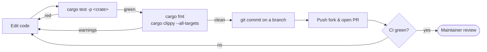

# Make and validate your first change

In this tutorial you will make a small change, prove it with a test, and run the
same checks CI runs — so your first pull request comes back green on the first
push. It assumes you've been through
[build, run, and test Oxigraph from source](build-run-test.md).

## 1. Find where your change belongs

Oxigraph is a workspace of focused crates: RDF data structures live in
`lib/oxrdf`, the parsers in `lib/oxttl`, `lib/oxrdfxml`, and `lib/oxjsonld`, the
SPARQL engine in `lib/spargebra`, `lib/sparopt`, and `lib/spareval`, and the
store itself in `lib/oxigraph`. The
[crate map](../reference/crates.md) tells you what each crate is responsible
for, and the [architecture overview](../explanation/architecture.md) shows how a
query flows through them.

For this tutorial we'll work in `lib/oxrdf`, the crate that defines the basic
RDF terms.

## 2. Make a change and cover it with a test

As a stand-in for a real fix, add a test that pins down behavior you care about.
Open `lib/oxrdf/src/literal.rs`, find the `mod tests` block at the bottom, and
add:

```rust
#[test]
fn simple_literal_roundtrip() {
    let literal = Literal::new_simple_literal("Oxigraph");
    assert_eq!("Oxigraph", literal.value());
}
```

For a real change the shape is the same: change the code, then add or adjust a
test in the same crate that fails without your change and passes with it.

## 3. Run the affected tests

```sh
cargo test -p oxrdf
```

Your new test appears in the output. Iterate here — this loop is much faster
than running the whole workspace.

## 4. Run the checks CI will run

CI enforces formatting, lints, and tests across the workspace. Run the same
gate locally:

```sh
cargo fmt                                              # fix formatting in place
cargo fmt -- --check                                   # …what CI actually checks
cargo clippy --all-targets -- -D warnings -D clippy::all
cargo test
```

Clippy warnings are errors in CI, so a clean local run means no lint surprises.
(On stable Rust, `cargo fmt` prints warnings about nightly-only options from the
repo's `rustfmt.toml` — they are harmless; the check still runs.)
CI additionally runs [`typos`](https://github.com/crate-ci/typos) for spelling
and `cargo deny check` for dependency licensing — worth installing if you touch
docs or dependencies.

## 5. Commit and open a pull request



Work on a branch in your fork, commit, push, and open a pull request against
`oxigraph/oxigraph`. One note on licensing: Oxigraph is dual-licensed under MIT
and Apache-2.0, and by submitting a contribution you agree it is dual-licensed
the same way, without additional terms — see the
[Contribution section of the README](../../../README.md#contribution).

## Undo the tutorial change

If you added the throwaway test above just to follow along, drop it before your
real work:

```sh
git checkout -- lib/oxrdf/src/literal.rs
```
