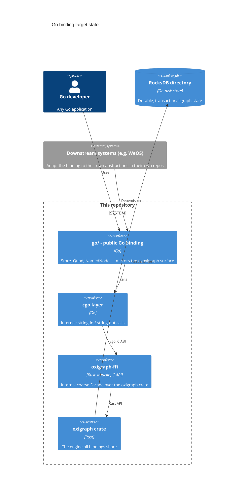
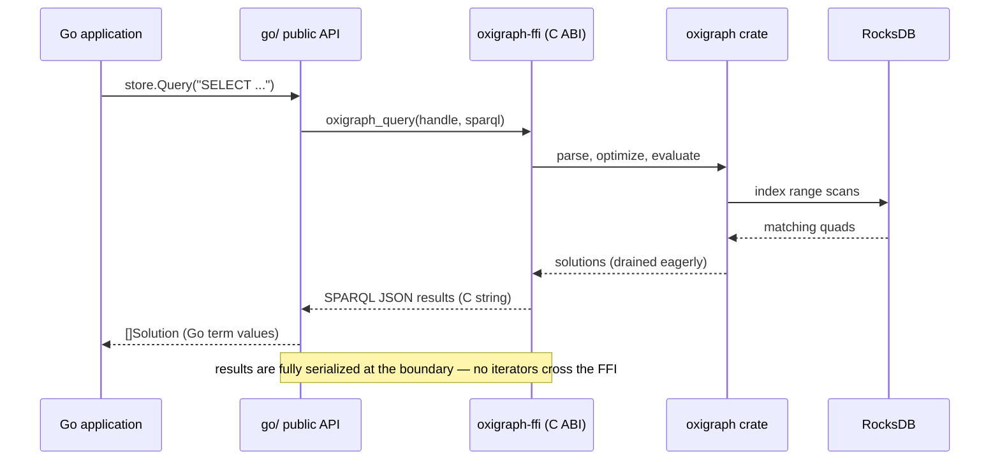

# Embed Oxigraph in Go via an in-tree binding over a minimal C ABI

- Status: accepted
- Date: 2026-07-03
- Deciders: Akeem Philbert

## Context and Problem Statement

Oxigraph embeds into Python (`pyoxigraph`) and JavaScript (the `oxigraph` npm
package) but not Go. Both existing bindings follow one pattern, documented in
[how the language bindings work](../contributors/explanation/language-bindings.md):
they live **in this repository**, version with the core, and are hand-written
wrappers exposing the `oxigraph` crate's surface (`Store`, the RDF model
types, SPARQL query/update, load/dump) in the host language's idiom — via a
Rust-native bridge (PyO3, wasm-bindgen), with no C ABI anywhere in the tree.

We want a Go binding with the same character: **a general-purpose Oxigraph
binding in Oxigraph's own vocabulary**, usable by any Go application. It must
not be shaped around any one consumer — downstream systems (for example WeOS,
which today reaches Oxigraph only over HTTP) adapt the binding to their own
abstractions in their own repositories.

The complication: Go has no Rust-native bridge equivalent to PyO3, so the
bridge mechanics cannot be copied — some foreign-function layer must be
chosen, and none exists in the tree today.

## Decision Drivers

Quality-attribute scenarios (stimulus → environment → response → measure):

1. **Binding idiom parity** — a developer who knows `pyoxigraph` picks up the
   Go binding → reading its docs and code → recognizes the same surface
   (`Store`, `Quad`, `NamedNode`, `Literal`, add/query/update/load/dump)
   expressed in Go idioms → **the public API maps method-for-method to
   pyoxigraph's core surface wherever Go allows**, and uses no
   consumer-specific nomenclature.
2. **Deployability** — a Go program starts on a fresh laptop or container
   with nothing pre-provisioned → graph features work → **zero processes
   beyond the Go binary**.
3. **Query latency** — an application issues on the order of 10² small SPARQL
   lookups in a burst (e.g. an agent's tool loop) → normal operation →
   answered in-process → **per-call overhead well under 1 ms** (no HTTP round
   trip).
4. **Buildability** — a consumer runs `go build` on macOS or Linux → a
   standard cgo-enabled toolchain suffices → **no local Rust toolchain
   required** (prebuilt static libraries ship with the module).
5. **Durability** — process restart → graph state survives on disk,
   transactionally → RocksDB-backed storage required.
6. **Binding maintainability** — an Oxigraph release lands → binding update
   confined to one small surface → **the C API stays small enough to
   re-verify in under a day**, and the binding versions with the core the way
   `python/` and `js/` do.

## Considered Options

1. **Status quo: out-of-process server + HTTP Gateway** (PoEAA *Gateway* over
   the W3C SPARQL Protocol) — what Go consumers must do today.
2. **In-tree Go binding (`go/`) over a new minimal C ABI crate
   (`oxigraph-ffi`)** — a *Facade* over the `oxigraph` crate compiled as a
   static library, consumed through cgo by a Go package whose public API
   mirrors `pyoxigraph`.
3. **WebAssembly embedding** — run the `wasm32` build of the engine inside a
   Go wasm runtime (e.g. wazero). Bespoke; no canonical pattern name.

## Decision Outcome

Chosen option: **2 — in-tree Go binding over a minimal C ABI**, because it is
the only option that satisfies deployability, durability, and latency at
once, and it extends the project's existing binding pattern rather than
inventing a new one: like `python/` and `js/`, the binding lives in this
repository, tracks the core's releases, and speaks Oxigraph's vocabulary. The
C ABI is the one necessary deviation from how PyO3/wasm-bindgen bind — Go's
only stable bridge to native code is cgo over a C ABI — and it is treated as
a **private implementation detail of the binding, not a public product**.

### The two layers

**`oxigraph-ffi` (new workspace crate, internal).** A deliberately
coarse-grained, string-based C ABI over the `oxigraph` crate — roughly:
`open(path)` / `open_in_memory()` / `close(handle)`,
`query(handle, sparql) → SPARQL JSON results (or serialized RDF for
CONSTRUCT/DESCRIBE)`, `update(handle, sparql)`, `load(handle, format,
bytes)`, `dump(handle, format)`, `last_error(handle)`. No iterators, term
objects, or transactions cross the boundary; results are fully serialized on
the Rust side. This sidesteps the classic FFI hazards (lifetimes, per-object
ownership) at the cost of materializing result sets — see Consequences.

> **Amendment (story #13).** `last_error` is replaced by a
> `char **error_out` out-parameter on every fallible function, freed with
> `free_string`. Go goroutines can migrate OS threads between cgo calls,
> so both thread-local and handle-external last-error state are racy from
> Go; per-call out-parameters carry no cross-call state and keep the same
> function budget.

**`go/` (new in-tree Go module, the public binding).** The API a user sees
mirrors `pyoxigraph`, in Go idiom — Oxigraph nomenclature only:

```go
store, err := oxigraph.Open("./data") // oxigraph.NewStore() for in-memory
defer store.Close()

err = store.Add(oxigraph.NewQuad(
    oxigraph.NewNamedNode("http://example.com/oxigraph"),
    oxigraph.NewNamedNode("http://www.w3.org/2000/01/rdf-schema#label"),
    oxigraph.NewLiteral("Oxigraph"),
    oxigraph.DefaultGraph(),
))

solutions, err := store.Query(`SELECT ?name WHERE { ?s ?p ?name }`)
for _, sol := range solutions {
    fmt.Println(sol.Get("name"))
}
```

The RDF term types (`NamedNode`, `BlankNode`, `Literal`, `Quad`, …) are
implemented natively in Go — construction and validation never cross the FFI;
only whole operations do. Iteration is over parsed, materialized results
initially; if streaming becomes necessary, the FFI can grow a chunked cursor
call without changing the public API.

Prebuilt static libraries per platform ship with the Go module (the
`mattn/go-sqlite3` vendored-library pattern; `rure-go` is the precedent for
Rust-behind-a-C-ABI), built by a CI job mirroring this repo's existing
`artifacts.yml` matrix.

### Consumers adapt downstream

WeOS — the motivating consumer, whose services already embed cgo-linked
storage (SQLite) and today mirror events to an Oxigraph server over HTTP —
would depend on `go/` and adapt it to its own `KnowledgeGraphStore` port **in
its own repository**. That adaptation, and any consumer's, is out of scope
here: the binding exposes Oxigraph's API, nothing else.

### Consequences

- Good, because any Go application gets an embedded, durable, full-fidelity
  Oxigraph with pyoxigraph-equivalent ergonomics — and because the binding
  follows the project's in-tree conventions, it is a credible candidate to
  propose upstream.
- Good, because a Go program needing a graph store becomes a single binary —
  no server to provision in dev, CI, or small deployments; per-query cost
  drops from an HTTP round trip to a cgo call.
- Good, because consumers that prefer a shared server keep the HTTP option —
  nothing is removed.
- Bad, because this repo takes on two maintained surfaces (the C ABI and the
  Go API). Mitigated by keeping the C ABI under ~10 string-based functions
  and letting the Go API track pyoxigraph's shape rather than inventing one.
  (**Sensitivity point:** binding-update effort tracks upstream release
  cadence.)
- Bad, because result sets are fully materialized at the boundary — the
  engine's lazy Volcano-style evaluation is not exposed. Acceptable for the
  embedded use cases this targets; huge analytical reads belong on the server
  deployment. (**Tradeoff point.**)
- Bad, because cgo constrains cross-compilation: each GOOS/GOARCH needs a
  native `liboxigraph_ffi` build. (**Sensitivity point:** consumer platform
  coverage is bounded by the prebuilt-library CI matrix.)

## Pros and Cons of the Options

### 1. Out-of-process server + HTTP Gateway (status quo)

- Good, because zero new code owned; the W3C protocol is stable; one shared
  graph can serve many processes.
- Bad, because it fails the deployability driver (an extra provisioned
  process everywhere) and the latency driver (HTTP per lookup).
- Bad, because it offers no pyoxigraph-like developer experience — no
  embedded store, no term/model API in Go.

### 2. In-tree Go binding over a minimal C ABI (chosen)

- Good, because embedded, durable (RocksDB), full-fidelity, and idiomatically
  consistent with the project's other bindings — same in-tree placement, same
  vocabulary, same "wrapper over the `oxigraph` crate" character.
- Good, because the cgo requirement matches how Go already embeds native
  databases (SQLite); consumers need no Rust toolchain.
- Neutral, because the C ABI deviates from the PyO3/wasm-bindgen mechanics —
  unavoidable for Go, and kept private to the binding.
- Bad, because FFI memory-safety and API-sync obligations now exist —
  contained by the small string-based surface, and testable by extending the
  repo's existing fuzz targets to the FFI entry points.
- Bad, because cgo slows builds slightly and complicates cross-compilation.

### 3. WebAssembly embedding (wazero)

- Good, because pure Go — no cgo anywhere; reuses the artifact the JS binding
  builds.
- Bad, because it fails the durability driver outright: the wasm build has no
  RocksDB, so storage is in-memory only.
- Bad, because wasm call overhead and memory limits fit a persistent database
  poorly, and a bespoke export surface would still need designing — the FFI
  work without the FFI payoff.

## Views

### Target state — container view



*(Audience: tech lead; question: what the binding consists of, what is public
vs internal, and where consumers sit.)*

### Runtime — one query through the boundary



*(Audience: the developer implementing the binding; question: what happens, in
order, on one query — and where laziness ends.)*

## Completeness notes (arc42 walk)

Covered here: goals & drivers (§Drivers), constraints (§Context), context and
building blocks (§container view), solution strategy & decisions (§Outcome),
runtime (§sequence), quality requirements (§Drivers), risks (§Consequences).
Consciously skipped as not risk-justified: deployment topology beyond the
prebuilt-library matrix, crosscutting concepts (the Go API follows pyoxigraph;
the crate follows workspace conventions), glossary.

## References

- [How the language bindings work](../contributors/explanation/language-bindings.md)
  — the project's binding pattern this decision extends, and why no C ABI
  exists today.
- [pyoxigraph API documentation](https://pyoxigraph.readthedocs.io/) — the
  surface the Go API mirrors.
- Precedents: [`rure-go`](https://github.com/BurntSushi/rure-go) (Go over a
  Rust C ABI), [`mattn/go-sqlite3`](https://github.com/mattn/go-sqlite3)
  (embedded C database via cgo with vendored native code).
