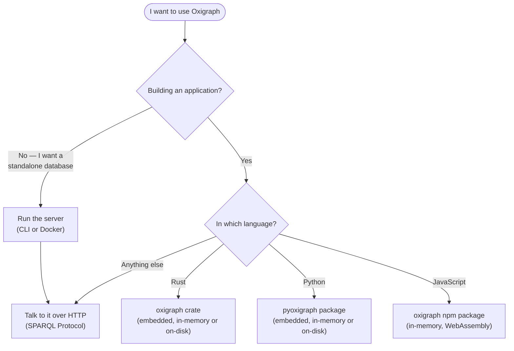

# Using Oxigraph

Documentation for people who want to install, run, and query Oxigraph.

- **[Tutorials](tutorials/README.md)** — learn by doing: install Oxigraph and run
  your first SPARQL query.
- **[How-to guides](how-to/README.md)** — task recipes: use Oxigraph from Rust,
  Python, JavaScript, or over HTTP.
- **[Reference](reference/README.md)** — where to look things up: the published API
  documentation for each package.
- **[Explanation](explanation/README.md)** — background on what Oxigraph is and how
  it fits into your stack.

## Which interface should I use?

Oxigraph ships as a standalone server and as an embedded library for three
languages. All of them expose the same store and the same SPARQL engine:

Start with [the getting-started tutorial](tutorials/getting-started.md) for the
server path, or jump straight to the how-to guide for
[Rust](how-to/rust.md), [Python](how-to/python.md),
[JavaScript](how-to/javascript.md), or [HTTP](how-to/http.md).

If you want to change Oxigraph itself, head over to the
[contributor documentation](../contributors/README.md).
